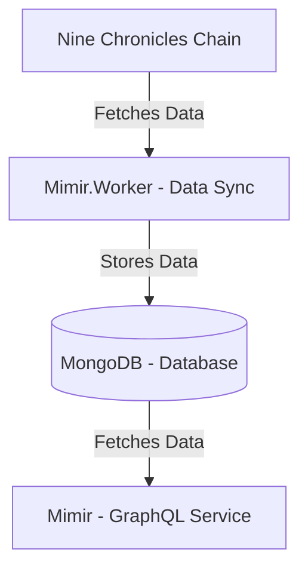

<div align="center">
    
    <h2>Mimir</h2>
    <p>A service that allows you to easily query real-time data from the Nine Chronicles chain via GraphQL.</p>

[][Discord]

</div>

[Discord]: https://planetarium.dev/discord

> [!TIP]
> If you're new to Nine Chronicles, try to visit our **Developer Portal**!
>
> https://nine-chronicles.dev/

# What is Mimir?

Mimir is a service that allows you to easily query real-time data from the Nine Chronicles chain via GraphQL.
Since all data is stored in DocumentDB (MongoDB), fast queries through indexing are possible.

## How to use?

Odin: https://mimir.nine-chronicles.dev/odin/graphql/
Heimdall: https://mimir.nine-chronicles.dev/heimdall/graphql/

It can be used on both Planets, and you can use [Banana Cake Pop](https://chillicream.com/docs/bananacakepop/v2/explore-the-ui) to create GraphQL queries in a UI.

## Structure

Mimir is composed of Mimir, which provides GraphQL, Mimir.Worker, which syncs data, and a database.
Mimir.Worker periodically fetches chain data and stores it in the database (MongoDB), while Mimir provides this data via GraphQL.



## Check Sync Index

Mimir synchronizes Nine Chronicles chain data with Mimir's database using Pollers.
Due to this, there may be differences between the actual chain and the stored data, and you can check which index the data is stored up to through the metadata collection.

```graphql
query {
    metadata(collectionName: "arena") {
        latestBlockIndex
    }
}
```

## Applications

Check out an example of a website created using Mimir: https://nine-chronicles.dev/modding/guide/avatar-information-dapp-guide
Create various applications using Mimir!

## Limitations

Mimir has a default rate limit.
If you need more access, please contact us on the Dev Discord with your use case and expected usage, and we will issue a key without restrictions.

## Contribution

If you want to contribute to the Mimir project, please check the [Contributor guide](CONTRIBUTING.md).
If you have suggestions or topics you'd like to discuss, please use the [Discussions](https://github.com/planetarium/mimir/discussions) section.

## License

Please note that Mimir is licensed under the AGPL-3.0 license. However, with the exception of the logo image, it is not licensed under AGPL-3.0. This is because it is Planetarium's asset.
