<div align="center">
    
    <h2>🌌 Mimir 🌌</h2>
    <p>A service that allows you to easily query real-time data from the Nine Chronicles chain via GraphQL.</p>

[][Discord]

</div>

[Discord]: https://planetarium.dev/discord

> ✨ **Tip:**  
> If you’re new to Nine Chronicles, don’t forget to visit our **Developer Portal** for all the basics!  
> 🔗 https://nine-chronicles.dev/

---

### 📑 Table of Contents

1. [What is Mimir?](#-what-is-mimir)
2. [How to Use?](#-how-to-use)
3. [Structure](#-structure)
4. [Check Sync Index](#-check-sync-index)
5. [Applications](#-applications)
6. [Limitations](#-limitations)
7. [Contribution](#-contribution)
8. [License](#-license)

---

### 📜 What is Mimir?

Mimir is a real-time data query service for the Nine Chronicles chain, built on GraphQL. With data stored in **DocumentDB (MongoDB)**, you get fast queries and indexed results.

### 🚀 How to Use?

- **Odin:** [mimir.nine-chronicles.dev/odin/graphql/](https://mimir.nine-chronicles.dev/odin/graphql/)
- **Heimdall:** [mimir.nine-chronicles.dev/heimdall/graphql/](https://mimir.nine-chronicles.dev/heimdall/graphql/)

Plus, use [Nitro](https://chillicream.com/docs/nitro/explore-the-ui) for building GraphQL queries with a great UI experience!

### 🔧 Structure

Mimir includes three main parts:  
1. **Mimir** - Provides the GraphQL service.  
2. **Mimir.Worker** - Syncs chain data regularly.  
3. **MongoDB** - Stores and indexes the data.

```mermaid
flowchart TD
    Mimir[Mimir - GraphQL Service 🚀]
    MimirWorker[Mimir.Worker - Data Sync 🔄]
    MongoDB[(MongoDB - Database 🗄️)]
    NineChroniclesChain[Nine Chronicles Chain 🌌]

    NineChroniclesChain -->|Fetches Data| MimirWorker
    MimirWorker -->|Stores Data| MongoDB
    MongoDB -->|Fetches Data| Mimir
```



---

### 📊 Check Sync Index

Mimir syncs chain data using **Pollers**. Since data may differ slightly from the chain, you can check the latest data block index with the following query:

```graphql
query {
    metadata(collectionName: "arena") {
        latestBlockIndex
    }
}
```

---

### 🌐 Applications

See a **sample site** using Mimir:  
https://nine-chronicles.dev/modding/guide/avatar-information-dapp-guide  
With Mimir, you can create a variety of applications! 🚀

### ⚠️ Limitations

Mimir has a default rate limit. Need more access? Message us on **Dev Discord** with your use case, and we’ll help!

### 🤝 Contribution

Want to contribute? Check out the [Contributor Guide](CONTRIBUTING.md), and join our [Discussions](https://github.com/planetarium/mimir/discussions) section with any suggestions! 🛠️

### 📜 License

Mimir is licensed under **AGPL-3.0**. Note that the logo is a Planetarium asset and not included in this license.


